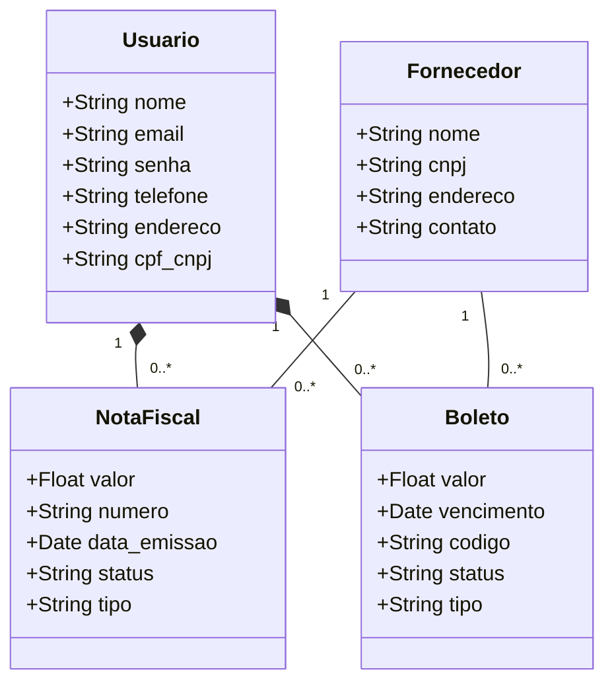

# Sentinela - Project Plan & Architecture

## Visão Geral
O **Sentinela** é uma aplicação para gestão de boletos e notas fiscais, permitindo que usuários se cadastrem, visualizem seus documentos financeiros e acompanhem o status de pagamentos.

Este projeto segue os princípios da **Programação Orientada a Objetos (POO)** e o **Princípio da Responsabilidade Única (SRP)**, estruturado em camadas para garantir manutenibilidade e escalabilidade.

## Origem
Somos alunos do **Bacharelado em Inteligência Artificial** da **Universidade Federal de Goiás** e estamos cursando a discplina de **Programação Orientada a Objetos (POO)**.

Este repositório foi construído para anexarmos o web service produzido no decorrer do projeto.

## Arquitetura do Projeto

O projeto será desenvolvido em **Python** utilizando o framework **Flask**. A arquitetura adotada separa a aplicação em camadas lógicas:

1.  **Models (Domínio)**: Definição das classes e regras de negócio fundamentais.
2.  **Repositories (Persistência)**: Abstração do acesso a dados (Banco de Dados).
3.  **Services (Aplicação)**: Regras de negócio complexas e orquestração entre repositórios e models.
4.  **Controllers/Views (Interface)**: Endpoints da API (Flask Blueprints) que recebem as requisições e retornam respostas.

### Diagrama de Classes 




## Estrutura de Diretórios

```
sentinela/
├── app/
│   ├── __init__.py          # Inicialização do Flask e configuração
│   ├── models/              # Camada de Domínio
│   │   ├── __init__.py
│   │   ├── usuario.py
│   │   ├── fornecedor.py
│   │   ├── nota_fiscal.py
│   │   └── boleto.py
│   ├── repositories/        # Camada de Persistência
│   │   ├── __init__.py
│   │   ├── usuario_repository.py
│   │   ├── fornecedor_repository.py
│   │   ├── nota_fiscal_repository.py
│   │   └── boleto_repository.py
│   ├── services/            # Camada de Serviço
│   │   ├── __init__.py
│   │   ├── auth_service.py
│   │   └── finance_service.py
│   └── controllers/         # Camada de Interface (Rotas)
│       ├── __init__.py
│       ├── auth_controller.py
│       └── finance_controller.py
├── config.py                # Configurações do projeto
├── run.py                   # Ponto de entrada da aplicação
├── requirements.txt         # Dependências
└── README.md                # Documentação
```

## Detalhamento das Camadas

### 1. Models
Classes que representam as entidades do sistema conforme o diagrama.
*   **Usuario**: Dados pessoais e de acesso.
*   **Fornecedor**: Dados da empresa emissora.
*   **NotaFiscal**: Detalhes da NF (valor, número, emissão).
*   **Boleto**: Detalhes do boleto (valor, vencimento, código de barras).

### 2. Repositories
Responsáveis por operações de CRUD.
*   **UsuarioRepository**: Salvar, buscar por email/id.
*   **FinanceRepository**: Salvar e buscar boletos e notas fiscais, filtrar por status (vencido, pago, a vencer).

### 3. Services
Lógica de negócio.
*   **AuthService**: Registro de usuário, login, validação de token.
*   **FinanceService**:
    *   Cálculo de totais (vencidos, a vencer, pagos).
    *   Associação de documentos a usuários e fornecedores.
    *   Regras de validação de datas.

### 4. Controllers
Endpoints da API.
*   **Auth**: `/register`, `/login`, `/profile`.
*   **Finance**:
    *   `/boletos` (GET, POST)
    *   `/notas-fiscais` (GET, POST)
    *   `/dashboard/summary` (GET - para os cards de resumo)

## Tecnologias
*   **Linguagem**: Python 3.x
*   **Framework Web**: Flask
*   **Banco de Dados**: SQLite (Dev) / PostgreSQL (Prod)
*   **ORM**: SQLAlchemy
